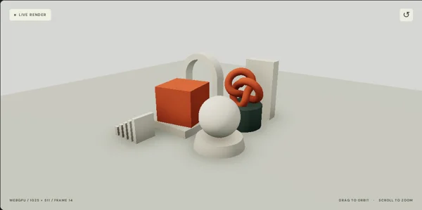

# N8AO WebGPU

Screen-space ambient occlusion for **Three.js r186**, written in TypeScript and TSL for native WebGPU.

A fork of [N8python/n8ao](https://github.com/N8python/n8ao), maintained as `three-n8ao-webgpu`.



[Documentation](docs/quick-start.md) · [Configuration](docs/configuration.md) · [API](docs/api.md) · [Examples](docs/examples.md) · [Compatibility](docs/compatibility.md)

## Get started

```sh
npm install three-n8ao-webgpu three@~0.186.0
```

```ts
import { RenderPipeline } from "three/webgpu";
import { n8ao } from "three-n8ao-webgpu";

// renderer is an initialized WebGPURenderer; scene and camera are yours.
const ao = n8ao(scene, camera, { aoRadius: 1.5, intensity: 3 });
const pipeline = new RenderPipeline(renderer);
pipeline.outputNode = ao;
renderer.setAnimationLoop(() => pipeline.render());
```

Requires native WebGPU, HTTPS or localhost, and one shared copy of Three.js. See the [quick start](docs/quick-start.md) for initialization, resizing and disposal. The npm install command applies once v1 is published; before then, install the tarball produced by `npm pack`.

## Features

- World-space and screen-space radius, quality presets and temporal accumulation.
- Bilateral and neural denoising, with a typed interface for custom TSL denoisers.
- Full and half resolution, perspective and orthographic cameras, logarithmic and reversed depth.
- Transparency-aware composition, fog, AO-only and split-screen views.
- Native RenderPipeline integration and explicit render adapters.
- Strict TypeScript, generated declarations, and independently owned render resources.

Rendering can differ from the WebGL original. The visual regression suite verifies preservation of the native WebGPU output, not bitwise WebGL equivalence. Read [compatibility and testing](docs/compatibility.md).

## Explore locally

```sh
npm ci
npm run dev
```

The local website includes documentation and six procedural scenes: contact shadows, a half-resolution courtyard, neural-filtered objects, transparent layers, fine detail and logarithmic depth. Orbit, zoom, change settings and copy a configuration into your application. Ambient occlusion is a real-time screen-space effect, not a lightmap baker.

## Development

```sh
npm run check       # TypeScript, unit tests, library and website builds
npm run build       # Package in dist/
npm run build:docs  # Static website in site-dist/
```

Run the optional [browser regression suite](docs/compatibility.md#test-commands) to verify rendering changes. See [CONTRIBUTING.md](CONTRIBUTING.md) for the architecture and [RELEASING.md](RELEASING.md) for GitHub Pages and npm setup.

## Credits and license

Derived from N8AO by N8 and contributors. The original algorithm, blue-noise data and neural model are retained with attribution. Library code is **CC0-1.0**; see [LICENSE](LICENSE) and [NOTICE](NOTICE) for bundled third-party material.
